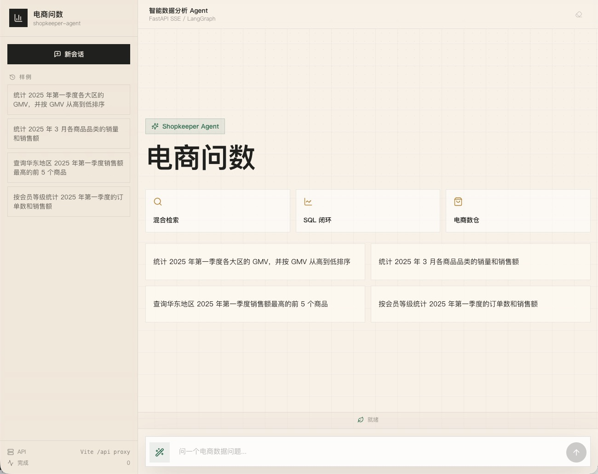
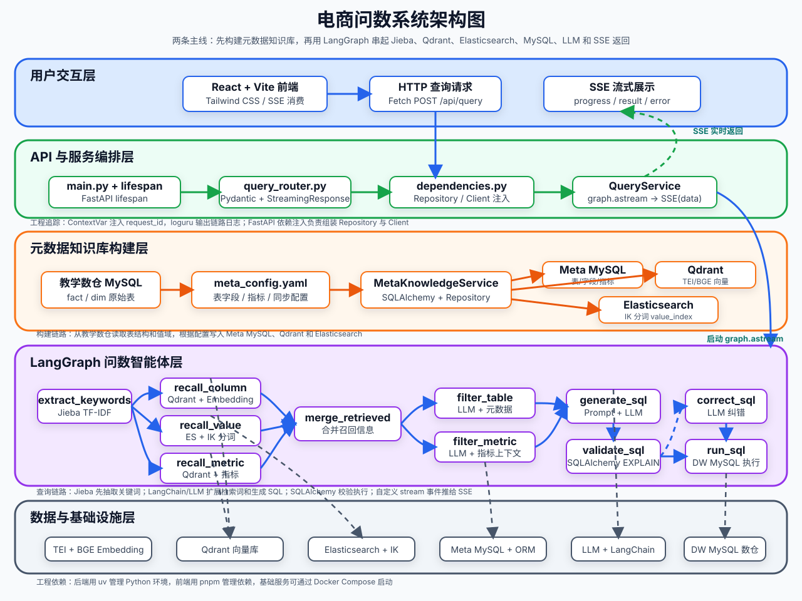
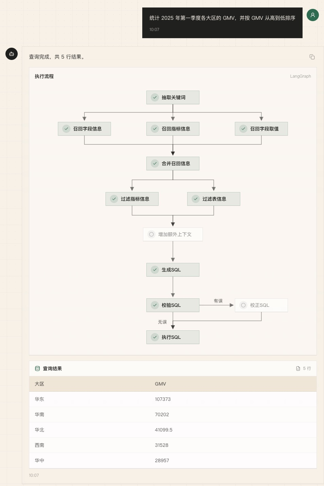

<div align='center'>
  <h1 style="margin-top: 15px;">「电商问数」智能数据分析 Agent</h1>
  <h4><b>shopkeeper-agent</b></h4>
  <p><em>可能是全网最适合用于系统学习 LangGraph 的智能问数实战项目，配套系统性文字教程与对应章节分支，带你打通混合检索、多阶段推理、SQL 生成与执行全链路</em></p>
</div>

<div align='center'>


</div>

**📢 说明**：本套实战项目已更新完成，配套教程、章节分支和前后端代码均可对照学习。

如果你正在找一个适合学习 `LangGraph`、`Qdrant`、`MySQL`、`FastAPI` 和 AI Agent 工程开发的实战项目，「电商问数」很可能是最适合你的项目。

它不是只调用一次大模型接口，也不是写几个 Prompt 演示 SQL 生成结果。这个项目围绕电商数仓问数场景，先构建元数据知识库，再做字段、指标、字段取值的混合检索，随后用 LangGraph 编排多阶段问数流程，完成 SQL 生成、校验、修正、执行和前端流式展示。换句话说，你学到的不是某一个框架 API，而是一条 AI 应用从数据准备、检索增强、智能体编排、接口交付到前端联调的完整项目主线。




## 📖 项目介绍

在真实问数场景里，业务同学通常不会写 SQL，数据分析同学也很难随时记住所有表结构、字段含义、指标口径和字段取值。单纯把自然语言问题直接交给大模型，很容易出现表选错、字段选错、指标理解错和 SQL 幻觉等问题。

`电商问数` 要解决的就是这个问题：

- 用户用自然语言提问
- 系统自动召回相关字段、指标和字段取值
- 大模型基于上下文进行分步推理
- 生成 SQL 并查询数据仓库
- 以流式方式返回分析结果

## ✨ 项目亮点

- **检索 + 推理 + 生成，而不是模型直出 SQL**
    - 先围绕问题召回相关字段、指标和值域，再组织上下文生成 SQL，整体链路更稳、更可控。
- **面向企业问数场景的混合检索**
    - `Qdrant` 负责字段和指标的语义召回。
    - `Elasticsearch` 负责字段取值的全文检索。
    - `MySQL` 负责保存完整、权威的结构化元数据。
- **支持字段、指标、取值三类信息协同召回**
    - 比单纯做表级或字段级检索更贴近真实企业分析流程。
- **从检索到执行的完整可运行链路**
    - 不停留在 Prompt 设计，而是会真实生成 SQL、执行查询，并以流式方式返回结果。
- **工程化后端结构清晰**
    - 基于 `FastAPI + LangGraph + Repository + Client Manager` 组织配置、客户端、仓储层、服务层与智能体流程，便于维护和扩展。
- **支持多轮对话与会话级上下文记忆**
    - 「那华东呢？」这类依赖上文的追问，会先经过**追问改写**补全为独立问题，再进入召回与 SQL 生成链路，而不是把省略主语的问题直接丢给大模型。
    - 会话历史可按 `session_id` 查询与清空，内存存储带 **LRU + 轮数上限 + TTL** 三重约束，避免无界增长。
- **不仅有实战代码，还有完整配套教程文档**
    - 项目配有一套系统化、持续更新、完全免费的教程讲义，适合按章节从数仓基础、元数据知识库到问数智能体流程逐步学习。
- **兼顾学习价值与可扩展性**
    - 既可以按教程章节逐步理解，也可以在此基础上继续扩展权限控制、SQL 审核、结果可视化等能力。

这套课程十分适合这些场景：

- 想系统学习 `LangGraph`，但不想只停留在几个玩具节点。
- 想把 `MySQL`、`Qdrant`、`Elasticsearch` 和大模型放到同一个业务场景里理解。
- 想做一个比简单模型调用更接近实际开发的 AI Agent 项目。
- 想把项目写进简历，并且能说清楚数据层、检索层、智能体层、服务层和前端层分别做了什么。

## 🏗️ 系统架构



项目围绕两条主线展开：

| 主线             | 做什么                                                                   | 涉及模块                                     |
| ---------------- | ------------------------------------------------------------------------ | -------------------------------------------- |
| 元数据知识库构建 | 抽取教学数仓中的表、字段、指标和字段取值，写入结构化库、向量库和全文索引 | `MySQL` / `Qdrant` / `Elasticsearch` / `TEI` |
| 自然语言问数     | 基于用户问题完成召回、上下文整理、SQL 生成校验执行，并把过程流式返回前端 | `LangGraph` / `FastAPI` / `SSE` / `React`    |



## 🛠️ 项目技术栈

| 模块       | 技术                              | 作用                                           |
| ---------- | --------------------------------- | ---------------------------------------------- |
| 教学数仓   | `MySQL`                           | 模拟事实表、维度表和分析型查询环境             |
| 元数据库   | `MySQL` / `SQLAlchemy`            | 保存表、字段、指标、字段指标关系等结构化元数据 |
| 向量检索   | `Qdrant`                          | 保存字段和指标向量，支持语义召回               |
| 全文检索   | `Elasticsearch`                   | 保存字段真实取值，支持关键词和值域检索         |
| Embedding  | `TEI` / `BAAI/bge-large-zh-v1.5`  | 将字段、指标、问题等文本转成向量               |
| 智能体编排 | `LangGraph`                       | 组织多阶段问数工作流                           |
| 会话记忆   | `asyncio.Lock` / `Protocol`       | 多轮上下文存储、追问改写与并发安全读写         |
| 模型接入   | `LangChain`                       | 封装 LLM 与 Embedding 调用                     |
| 后端接口   | `FastAPI`                         | 提供问数 API、依赖注入和生命周期管理           |
| 流式协议   | `SSE`                             | 实时返回节点进度、查询结果和错误消息           |
| 前端       | `React` / `Vite` / `Tailwind CSS` | 提供聊天式问数界面和流程展示                   |
| 日志追踪   | `ContextVar` / `loguru`           | 为并发请求注入 request_id，便于排查链路        |
| 依赖管理   | `uv` / `pnpm`                     | 管理 Python 后端和前端依赖                     |

## 📁 项目结构

```text
shopkeeper-agent/
├── app/
│   ├── agent/            # LangGraph 图、状态、上下文和各类节点
│   ├── api/              # FastAPI 路由、依赖注入、生命周期和请求结构
│   ├── clients/          # MySQL、Qdrant、Elasticsearch、Embedding 客户端管理
│   ├── conf/             # 配置 dataclass 与配置加载工具
│   ├── core/             # 日志、request_id 上下文等通用能力
│   ├── entities/         # 更贴近业务语义的数据对象
│   ├── models/           # SQLAlchemy ORM 模型
│   ├── prompt/           # Prompt 加载工具
│   ├── repositories/     # MySQL、Qdrant、Elasticsearch 数据访问层
│   ├── scripts/          # 元数据知识库构建脚本
│   └── services/         # 元数据构建服务、问数查询服务、会话记忆存储
├── conf/                 # app_config.yaml、meta_config.yaml
├── docker/               # Docker Compose、MySQL 初始化 SQL、ES 插件、Embedding 挂载目录
├── eval/                 # 评测集与自动化回归脚本
├── frontend/             # React + Vite + Tailwind CSS 前端项目
├── prompts/              # 追问改写、SQL 生成、修正、过滤等 Prompt 模板
├── tests/                # 单元测试（sql_guard / 节点 / 图 / 会话存储 / API）
├── main.py               # FastAPI 应用入口
└── pyproject.toml        # Python 项目依赖与工具配置
```

## 🚀 快速开始

### 方式一：容器化一键启动（推荐）

项目已完成容器化封装，后端、前端与全部基础设施（MySQL / Elasticsearch / Qdrant / Embedding）均由 Docker Compose 编排，双击脚本即可一键拉起，无需手动安装 Python、Node 或逐个启动服务。

1. 安装并启动 [Docker Desktop](https://www.docker.com/products/docker-desktop/)
2. 复制环境变量模板并填写大模型密钥：

```bash
cp .env.example .env   # 然后编辑 .env 填入 LLM_API_KEY
```

3. 双击 `启动电商问数.ps1`，脚本会自动拉起 Docker 引擎、启动全部容器、等待后端就绪并打开浏览器：

```text
前端界面：http://localhost:5173
接口文档：http://localhost:8000/docs
健康检查：http://localhost:8000/health/ready
```

4. 停止服务：双击 `停止电商问数.ps1`

> 首次运行会构建镜像（约 1-3 分钟）；之后日常启动直接复用镜像，秒级拉起。
> 容器由 Docker 守护进程托管，关闭脚本窗口不会停止服务。

### 方式二：本地开发模式（手动启动）

如果需要逐个组件调试，可按以下顺序手动启动：

### 1. 准备环境

- Python `>= 3.14`
- `uv`
- Docker 与 Docker Compose
- Node.js 与 `pnpm`

### 2. 克隆项目

```bash
cd shopkeeper-agent
```

### 3. 安装后端依赖

```bash
uv sync
```

### 4. 配置大模型 API Key

```bash
cp .env.example .env
```

把 `.env` 中的 `LLM_API_KEY` 替换成真实密钥：

```bash
LLM_API_KEY=your_real_api_key
```

默认配置使用兼容 OpenAI 接口的硅基流动服务：

```yaml
llm:
    model_name: Pro/zai-org/GLM-5.1
    api_key: ${oc.env:LLM_API_KEY}
    base_url: https://api.siliconflow.cn/v1
```

如需使用其他兼容 OpenAI API 的模型平台，修改 [conf/app_config.yaml](conf/app_config.yaml) 中的 `model_name` 和 `base_url`。

### 5. 准备 Embedding 模型

项目通过 `TEI` 加载 `BAAI/bge-large-zh-v1.5`。模型文件体积较大，无法再仓库中进行提交，需要先下载到 Docker 挂载目录：

```bash
uv run hf download BAAI/bge-large-zh-v1.5 --local-dir docker/embedding/bge-large-zh-v1.5
```

如果手动下载，请解压到：`docker/embedding/bge-large-zh-v1.5`路径下。

### 6. 启动 Docker 基础服务

```bash
docker compose -f docker/docker-compose.yaml up -d
```

默认端口：

| 服务          | 端口   |
| ------------- | ------ |
| MySQL         | `3306` |
| Elasticsearch | `9200` |
| Kibana        | `5601` |
| Qdrant        | `6333` |
| Embedding     | `8081` |

> `docker/mysql/meta.sql` 和 `docker/mysql/dw.sql` 会在 MySQL 容器首次启动时自动初始化元数据库和教学数仓。

### 7. 构建元数据知识库

```bash
uv run python -m app.scripts.build_meta_knowledge -c conf/meta_config.yaml
```

这一步会把表字段元数据写入 MySQL，把字段和指标向量写入 Qdrant，并把字段真实取值写入 Elasticsearch。

### 8. 启动后端

```bash
uv run fastapi dev main.py
```

后端接口：

```text
POST http://127.0.0.1:8000/api/query
```

请求示例：

```json
{
    "query": "统计华北地区的销售总额"
}
```

带会话上下文的追问示例（`session_id` 由首轮响应的 `session` 事件下发，追问时原样回传即可）：

```json
{
    "query": "那华东呢？",
    "session_id": "0f3c1d9a-8b7e-4c2f-9a10-2b8d5e6f7c01"
}
```

SSE 消息类型：

| 类型       | 含义                                             |
| ---------- | ------------------------------------------------ |
| `session`  | 会话标识，流开始时下发，前端保存后用于延续上下文 |
| `progress` | 节点执行进度                                     |
| `result`   | 最终查询结果，附带本轮 `sql` 与 `resolved_query` |
| `error`    | 全局异常消息                                     |

会话管理接口：

| 方法     | 路径                        | 作用                             |
| -------- | --------------------------- | -------------------------------- |
| `GET`    | `/api/session/{session_id}` | 查询该会话的历史轮次             |
| `DELETE` | `/api/session/{session_id}` | 清空该会话（不存在返回 `404`）   |
| `GET`    | `/api/sessions`             | 会话列表与存储统计               |

### 9. 启动前端

```bash
cd frontend
pnpm install
pnpm dev
```

前端默认通过 Vite 代理把 `/api` 转发到 `http://127.0.0.1:8000`。如需修改：

```bash
cd frontend
cp .env.example .env
```

```bash
VITE_DEV_PROXY_TARGET=http://127.0.0.1:8000
```

## 🚧 能力边界

这套项目主要关注智能问数的学习流程，不刻意覆盖生产治理能力，例如：

- 用户登录、角色权限和数据权限控制
- 多租户隔离
- SQL 安全审计和执行白名单
- 查询缓存、限流和性能治理
- 系统化评测集与自动化回归评测
- 监控告警、链路追踪平台和灰度发布
- 分布式会话存储与跨实例共享

这些能力适合在基础流程跑通之后继续扩展。`shopkeeper-agent` 更适合承担一个清晰角色：先把智能问数最关键、最必要、最值得学习的工程链路讲清楚、跑起来，并为后续扩展企业级能力打基础。

## 🧪 工程质量与评测

在上述核心链路之外，项目补齐了支撑「可上生产 / 可写入简历」的六块工程能力。

### 1. 单元测试与覆盖率

```bash
uv run pytest                                    # 运行全部测试
uv run pytest --cov=app --cov-report=term-missing  # 带覆盖率
uv run pytest tests/test_sql_guard.py -v         # 只跑 SQL 护栏
```

测试全部使用 mock 隔离外部依赖，**不需要启动 MySQL / Qdrant / ES 即可在 CI 中运行**：

| 测试文件 | 覆盖内容 |
|----------|----------|
| `tests/test_sql_guard.py` | SQL 安全护栏：语句白名单、多语句注入、LIMIT 补齐与收紧 |
| `tests/test_nodes.py` | 节点逻辑：关键词抽取、追问改写、日期上下文构建、异常时的进度事件 |
| `tests/test_graph.py` | LangGraph 编排契约：14 节点注册、追问改写入口、三路并行召回、修正闭环连边 |
| `tests/test_session_store.py` | 会话存储：读写、LRU 淘汰、轮数截断、TTL 过期、并发写入、会话 id 生成 |
| `tests/test_api.py` | API 层：健康检查、request_id 中间件、SSE 协议、参数校验、会话接口 |

### 2. SQL 安全护栏（SQLGuard）

`app/core/sql_guard.py` 在 LLM 生成的 SQL 抵达数仓前建立**与模型无关的程序化防线**。这是「Prompt 约束 ≠ 安全边界」的工程落地：

- **语句类型白名单**：仅放行 `SELECT` / `WITH`，拦截 DDL / DML / 授权语句
- **强制行数上限**：无 `LIMIT` 自动补齐，超界 `LIMIT` 收紧，防止全表拉取拖垮服务
- **多语句注入拦截**：拒绝分号拼接
- **字面量感知扫描**：`WHERE name = 'delete'` 不会误杀，`; DROP TABLE x` 必被拦截

### 3. 有界重试与失败可见

原始的 SQL 修正循环只重试一次，失败即抛异常中断流。改造后：

- `correct_sql` → `validate_sql` 形成**修正闭环**，并受 `MAX_SQL_RETRY` 上限约束
- 重试耗尽进入 `give_up` 节点，把最后一次数据库错误**结构化返回前端**，而不是让请求悬挂
- SSE 进度事件保证前端进度条不会卡在 `running`

### 4. 多轮会话记忆与追问改写

真实问数场景里，用户的第二句往往是不完整的问题——「那华东呢？」「换成第二季度」「再按品类分一下」。这类问题**单独看无法召回任何有效字段**，如果直接送给大模型，只会得到一次幻觉 SQL。

项目在 LangGraph 图的**入口**新增 `resolve_followup` 节点，把多轮能力收敛成一条清晰的链路：

```text
START → resolve_followup → extract_keywords → （多路召回）→ ... → run_sql
         ↑ 读取会话历史        ↑ 下游统一使用 resolved_query
         └ 改写为独立问题
```

设计要点：

- **入口节点，下游无感知**：改写发生一次，下游 8 个节点全部读取 `resolved_query`，不需要各自处理上下文。
- **首轮零开销**：无历史时直接透传，不发起多余的 LLM 调用。
- **降级优先**：改写失败或返回空值时回退为原始问题，并照常上报成功进度——增强能力不应该成为主链路的单点故障。
- **读写位置明确**：历史在**图执行前**注入 `State`、在**图执行后**的 `finally` 中落库，收敛在 Service 层而非散落在节点内部。
- **存储三重约束**：会话数 LRU 淘汰（默认 500）、单会话保留轮数上限（默认 10）、TTL 惰性过期（默认 3600 秒），`asyncio.Lock` 保证同一会话并发写入不丢轮次。
- **接口可替换**：`SessionStore` 以 `typing.Protocol` 定义，内存实现只是默认实现，替换 Redis 不需要改动业务代码。

```bash
# 追问改写提示词
prompts/resolve_followup.prompt

# 存储实现与测试
app/services/session_store.py
tests/test_session_store.py
```

### 5. 评测集与自动化回归

```bash
uv run python -m eval.run_eval --mode recall              # 召回层评测
uv run python -m eval.run_eval --mode recall --report r.json
```

`eval/golden_set.yaml` 维护问题 → 期望表/字段/指标的对照关系，脚本按**表召回率、字段召回率、指标召回率与指标精确率**打分，并以非零退出码作为 CI 回归门禁。有了它，调整 Prompt 或召回阈值才能判断「是变好还是变坏」。

### 6. 部署与 CI

- `Dockerfile`：两阶段构建 + 非 root 用户运行 + 容器健康检查
- `.github/workflows/ci.yaml`：ruff lint/format → pytest 覆盖率 → Docker 镜像构建验证

> 仍属边界之外：用户鉴权、多租户隔离、查询缓存、链路追踪平台、监控告警。<br>
> 已完成的能力演进顺序是 **SQL 安全护栏 → 有界重试 → 单元测试与评测集 → 多轮会话记忆**；<br>
> 若继续推进，建议优先级为 **身份与数据权限 → 会话存储外置（Redis）→ 结果导出与可视化**。
